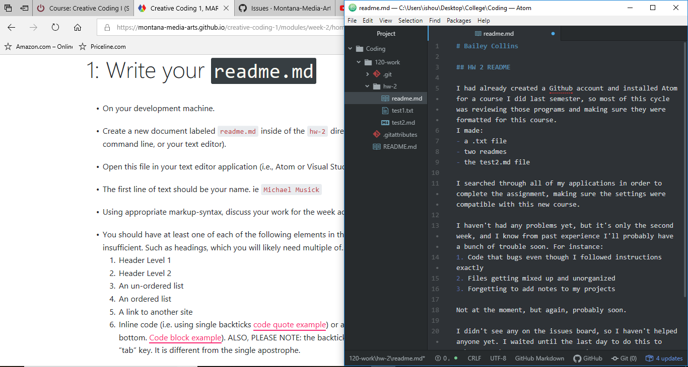

# Bailey Collins

## HW 2 README

I had already created a Github account and installed Atom for a course I did last semester, so most of this cycle was reviewing those programs and making sure they were formatted for this course.
I made:
- a .txt file
- two readmes
- the test2.md file

I searched through all of my applications in order to complete the assignment, making sure the settings were compatible with this new course.

I haven't had any problems yet, but it's only the second week, and I know from past experience I'll probably have a bunch of trouble soon. For instance:
1. Code that bugs even though I followed instructions exactly
2. Files getting mixed up and unorganized
3. Forgetting to add notes to my projects

Not at the moment, but again, probably soon.

I didn't see any on the issues board, so I haven't helped anyone yet. I waited until the last day to do this to make sure, but everyone seems good.

[Here's my Github thing](https://github.com/bailey-collins?tab=repositories) 



```javascript
var der;
der = "I don't know how to code yet...";
```
